# Architecture

> A deep-dive into how **JS Visualizer** is structured, how data flows through the system, and why each architectural decision was made.

**Live demo:** [js-visualizer.gouranga.qzz.io](https://js-visualizer.gouranga.qzz.io)  
**Repository:** [github.com/GourangDasSamrat/js-visualizer](https://github.com/GourangDasSamrat/js-visualizer)

---

## Table of Contents

- [High-Level System Overview](#high-level-system-overview)
- [Folder Structure](#folder-structure)
- [Layer Breakdown](#layer-breakdown)
- [Execution Engine](#execution-engine)
- [State Machine](#state-machine)
- [Component Tree](#component-tree)
- [Data Flow — Step Lifecycle](#data-flow--step-lifecycle)
- [Animation Pipeline](#animation-pipeline)
- [Technology Decisions](#technology-decisions)

---

## High-Level System Overview

```mermaid
graph TB
    subgraph Browser["🌐 Browser — Desktop Only"]

        subgraph Presentation["Presentation Layer"]
            EP["EditorPanel\n(CodeMirror 6)"]
            VG["Visualizer Grid\n6 live panels"]
            CT["Controls\nRun · Next · Prev"]
        end

        subgraph StateLayer["State Layer — Zustand"]
            ST["executionStore\ncode · steps · currentStep\nstatus · theme"]
        end

        subgraph EngineLayer["Execution Engine — TypeScript / WASM-ready"]
            PRS["Code Parser\nLine-by-line pattern analysis"]
            SIM["Runtime Simulator\nStack · Queues · Web APIs · Contexts"]
            SNP["Snapshot Generator\nImmutable ExecutionStep[]"]
        end

        subgraph AnimLayer["Animation Layer — GSAP 3"]
            GSAP["Timeline Orchestrator\nstack push/pop · queue in/out\nevent loop tick · line highlight"]
        end

    end

    EP -- "code string" --> ST
    CT -- "runCode()" --> EngineLayer
    PRS --> SIM --> SNP
    SNP -- "steps[]" --> ST
    ST -- "currentStep" --> VG
    VG -- "DOM refs" --> GSAP
```



---

## Folder Structure

```
js-visualizer/
├── docs/
│   ├── ARCHITECTURE.md
│   ├── CONTRIBUTING.md
│   ├── CODE_OF_CONDUCT.md
│   └── SECURITY.md
├── public/
├── src/
│   ├── components/
│   │   ├── Editor/
│   │   │   └── EditorPanel.tsx        # CodeMirror 6, theme switcher, active-line highlight
│   │   ├── Visualizer/
│   │   │   ├── CallStack.tsx          # Animated LIFO stack panel
│   │   │   ├── ExecutionContext.tsx   # Scope frames + variable bindings
│   │   │   ├── WebApis.tsx            # Async delegation panel
│   │   │   ├── QueuePanel.tsx         # Task Queue + Microtask Queue (shared)
│   │   │   ├── EventLoop.tsx          # Rotating loop indicator
│   │   │   └── ConsolePanel.tsx       # Simulated console.log output
│   │   ├── Controls/
│   │   │   └── Controls.tsx           # Run / Next / Prev / progress scrubber
│   │   └── Layout/
│   │       ├── AppLayout.tsx          # Full-screen grid, panel wiring
│   │       └── MobileBlock.tsx        # Desktop-only gate
│   ├── engine/
│   │   └── ExecutionEngine.ts         # Core simulation logic (WASM-replaceable)
│   ├── store/
│   │   └── executionStore.ts          # Zustand global store
│   ├── types/
│   │   └── execution.ts               # All TypeScript interfaces & enums
│   ├── styles/
│   │   └── globals.css                # Tailwind v4 import + scrollbar overrides
│   ├── App.tsx
│   └── main.tsx
├── index.html
├── vite.config.ts
├── tsconfig.app.json
├── tsconfig.node.json
├── tsconfig.json
├── package.json
├── README.md
└── LICENSE
```

---

## Layer Breakdown


---

## Execution Engine

The `ExecutionEngine` class is the heart of the application. It consumes raw JavaScript source code and emits a deterministic, ordered array of `ExecutionStep` snapshots — one per meaningful runtime event.


### WASM Boundary

The engine exposes a single public method:

```typescript
class ExecutionEngine {
  analyze(code: string): ExecutionStep[]
}
```

This interface is intentionally thin. Swapping in a WASM-compiled engine (e.g. a QuickJS build targeting Wasm32) requires only replacing this class while keeping all UI, state, and animation layers intact.

---

## State Machine


| Status | Description |
|--------|-------------|
| `idle` | No execution in progress. Editor is editable. |
| `paused` | Steps generated. User navigating with Next / Prev. |
| `complete` | Final step reached. Run again or reset. |

---

## Component Tree


---

## Data Flow — Step Lifecycle


---

## Animation Pipeline

Every visualizer panel holds a `useRef` to its DOM container and a `prevEntriesRef` to track the previous state. On each render, GSAP diffs the two and fires targeted animations.

```mermaid
flowchart LR
    RE["React render\n(new currentStep)"] --> DIFF["useEffect diff:\nnewEntries vs prevEntries"]

    DIFF --> PUSH["Entries added?\ngsap.fromTo — slide in\nscale + opacity"]
    DIFF --> POP["Entries removed?\nCSS transition — fade out"]
    DIFF --> RESOLVE["Status changed?\ngsap.to — color shift\nglow pulse"]

    PUSH --> DOM["DOM updates\n(smooth, 0.3–0.5s)"]
    POP --> DOM
    RESOLVE --> DOM

    DOM --> PREVREF["prevEntriesRef.current = [...entries]"]
```



**GSAP ease profiles used per panel:**

| Panel | Ease | Duration |
|-------|------|----------|
| Call Stack push | `back.out(1.5)` | 0.4s |
| Execution Context push | `power2.out` | 0.4s |
| Web APIs add | `elastic.out(1, 0.6)` | 0.5s |
| Queue enqueue | `power2.out` | 0.4s |
| Console line | `power2.out` | 0.3s |
| Event loop ring | `power2.out` (glow) | 0.5s |

---

## Technology Decisions

| Decision | Choice | Rationale |
|----------|--------|-----------|
| UI framework | React 19 + TypeScript | Component model fits panel-per-runtime-concept design |
| Styling | Tailwind CSS v4 | Zero raw CSS, utility-first, dark mode trivial |
| State | Zustand | Minimal boilerplate, selector-based subscriptions, no Provider needed |
| Animations | GSAP 3 | Frame-accurate, imperative DOM control — React spring cannot target individual stack frames reliably |
| Editor | CodeMirror 6 via `@uiw/react-codemirror` | Extension model allows custom active-line decorations |
| Build | Vite | Sub-second HMR, native ESM, tree-shaking |
| Execution model | Pre-computed step snapshots | Deterministic, time-travel debugging, no async race conditions in UI |
| Mobile | Blocked | Layout density requires ≥ 1280px; no degraded mobile fallback |
